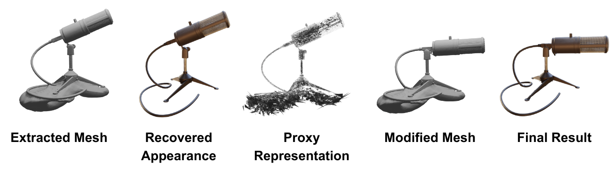

<h1>Neural Surface Priors for Editable Gaussian Splatting</h1>
Jakub Szymkowiak, Weronika Jakubowska, Dawid Malarz, Weronika Smolak-Dyżewska, Maciej Zięba, Przemysław Musialski, Wojtek Pałubicki, Przemysław Spurek
   
  

  

 
 
This repository contains the implementation for the paper [Neural Surface Priors for Editable Gaussian Splatting](https://arxiv.org/abs/2411.18311)

**Abstract:** In computer graphics, there is a need to recover easily modifiable representations of 3D geometry and appearance from image data.
We introduce a novel method for this task using 3D Gaussian Splatting, which enables intuitive scene editing through mesh adjustments.
Starting with input images and camera poses, we reconstruct the underlying geometry using a neural Signed Distance Field and extract a high-quality mesh. 
Our model then estimates a set of Gaussians, where each component is flat, and the opacity is conditioned on the recovered neural surface.
To facilitate editing, we produce a proxy representation that encodes information about the Gaussians' shape and position. 
Unlike other methods, our pipeline allows modifications applied to the extracted mesh to be propagated to the proxy representation, from which we recover the updated parameters of the Gaussians. 
This effectively transfers the mesh edits back to the recovered appearance representation.
By leveraging mesh-guided transformations, our approach simplifies 3D scene editing and offers improvements over existing methods in terms of usability and visual fidelity of edits.

 
Code will be added soon.
