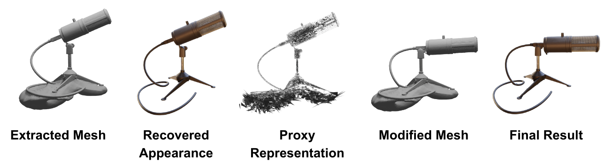

<div align="center">
<h1>Neural Surface Priors for Editable Gaussian Splatting</h1>
Jakub Szymkowiak, Weronika Jakubowska, Dawid Malarz, Weronika Smolak-Dyżewska, Maciej Zięba, Przemysław Musialski, Wojtek Pałubicki, Przemysław Spurek
<br> <br>
  
[](https://arxiv.org/abs/2411.18311)
[](assets/Neural_Surface_Priors_for_Editable_Gaussian_Splatting.mp4)
  
</div>

 
 
This repository contains the implementation for the paper [Neural Surface Priors for Editable Gaussian Splatting](https://arxiv.org/abs/2411.18311)


**Abstract:** In computer graphics, there is a need to recover easily modifiable representations of 3D geometry and appearance from image data.
We introduce a novel method for this task using 3D Gaussian Splatting, which enables intuitive scene editing through mesh adjustments.
Starting with input images and camera poses, we reconstruct the underlying geometry using a neural Signed Distance Field and extract a high-quality mesh. 
Our model then estimates a set of Gaussians, where each component is flat, and the opacity is conditioned on the recovered neural surface.
To facilitate editing, we produce a proxy representation that encodes information about the Gaussians' shape and position. 
Unlike other methods, our pipeline allows modifications applied to the extracted mesh to be propagated to the proxy representation, from which we recover the updated parameters of the Gaussians. 
This effectively transfers the mesh edits back to the recovered appearance representation.
By leveraging mesh-guided transformations, our approach simplifies 3D scene editing and offers improvements over existing methods in terms of usability and visual fidelity of edits.


 

# Install
Before you begin, ensure you have Docker installed on your machine.

First, clone the repository to your local machine using the following command:
```Shell
git clone https://github.com/WJakubowska/3D_Gaussian_Splatting_with_PermutoSDF.git
cd 3D_Gaussian_Splatting_with_PermutoSDF
chmod +x build.sh
chmod +x run.sh
```
In the run.sh file:
 - Line 32: Replace the path with the location of your data folder. The suggested folder name is permuto_sdf_data. Ensure that this folder is located on your local machine
 - Line 33: Update the path to the folder where the data from the container will be saved.


Run the build script to create and run the Docker image. You can execute the following command:
```Shell
./build.sh
./run.sh
```
Upon the first launch of the container, a script will be executed that will install all the necessary dependencies.

# Data

For training and experiments, we used the NeRF Synthetic dataset (https://paperswithcode.com/dataset/nerf). This dataset can be downloaded from platforms such as Kaggle: https://www.kaggle.com/datasets/nguyenhung1903/nerf-synthetic-dataset. Once downloaded, the dataset should be extracted and copied to the data folder, the path to which was specified in the previous step in the run.sh file. If your folder name differs from the default "permuto_sdf_data," navigate to the file permuto_sdf_py/paths/data_paths.py and set your folder name in the comp_3 variable.

# Train 

First, you need to train the PermutoSDF model. To do this, run the following commands:
```cd permuto_sdf
./permuto_sdf_py/train_permuto_sdf.py --dataset nerf --scene lego --comp_name comp_3 --exp_info default --no_viewer
```
Replace lego in --scene with the scene you want to train the model on. The training results will be saved in the checkpoints folder.

After training is complete, you can generate a mesh by running:
```
./permuto_sdf_py/experiments/evaluation/create_my_meshes.py --dataset nerf --comp_name comp_3 --res 1000
```
If you trained the model on a scene other than lego, you need to check the files permuto_sdf/permuto_sdf_py/path/list_of_checkpoints.py and permuto_sdf/permuto_sdf_py/path/list_of_training_scenes.py. Select the corresponding scene for which you want to generate the mesh.

Next, use the following commands to navigate to the next part of the code:
```
cd ..
cd 3DGS_for_SDF
```
To start the training, run the command:
```
python train.py --eval
-s /mnt/data/permuto_sdf_data/nerf_synthetic/lego # path to the dataset
--beta 300 # beta value
--opt_sdf 0.1 # regularization coefficient
--model_sdf_path /workspace/permuto_sdf/checkpoints/permuto_sdf_lego_default/200000/models/sdf_model.pt # path to the trained sdf model
--mesh_path /workspace/permuto_sdf/results/output_permuto_sdf_meshes/nerf/with_mask_False/lego.ply #path to the generated mesh
```

You can render training/test sets and produce error metrics as follows:
```
python render.py -m <path to trained model>
python metrics.py -m <path to trained model>
```

# Editing 3D objects
To modify the obtained Gaussians, open the generated mesh using a mesh editing program, such as Blender. Then, make modifications to the mesh and save the modified mesh.

To run the code responsible for transforming the Gaussians, use the following command:
```
python transform.py
--source_dir lego
--output_dir lego
--mesh_original_name lego.obj
--mesh_modified_name lego_change.obj
--gaussians_name point_cloud/iteration_30000/point_cloud.ply
```
Where:

- source_dir  is the source folder containing the saved flat Gaussians, the point cloud, the generated mesh, and the modified mesh. This can also be the output folder from the training process.
- output_dir is the folder where the modified Gaussians will be saved (it can be the same as source_dir).
- mesh_original_name is the name of the generated mesh located in the source_dir folder.
- mesh_modified_name is the name of the modified mesh located in the source_dir folder.
- gaussians_name is the name of the point cloud file.

